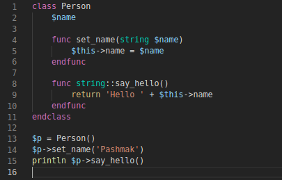

# vscode Pashmak
The Pashmak programming language syntax highlighter for **Visual Studio Code**

<a href="data/preview.png">
	
</a>

## Get started
To install this extension manually, copy this folder to `<home>/.vscode/extensions`, then open the vscode:

Clone this repo and then:

```bash
$ cd /path/to/vscode-pashmak/
$ cp . ~/.vscode/extensions/ -avr
```

Now, for a test, you can open `test.pashm`:

```bash
$ code test.pashm
```

Enjoy it!
